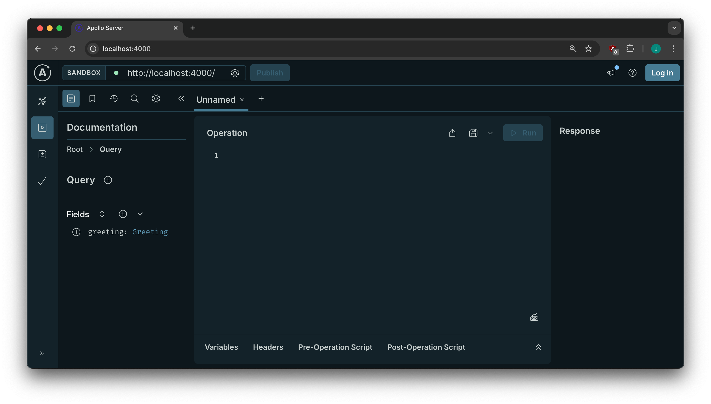
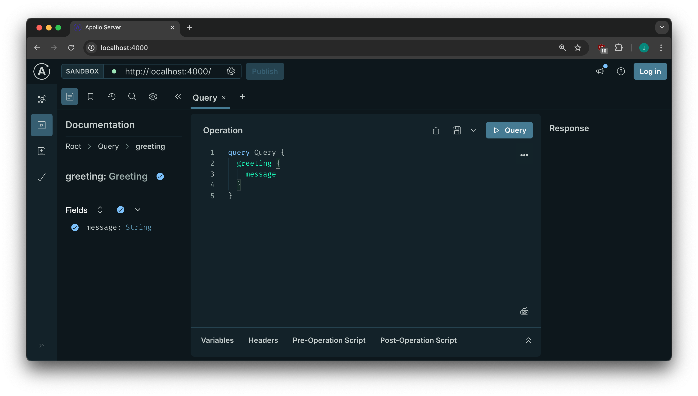

# GraphQL Server using Apollo Server

These are the class files for the GraphQL Server using Apollo Server class

## Setup

Clone this repository.

```shell
cd apollo-server
npm install
npm run start:demos
```

You should see a message that looks like this:
```shell
❯ npm run start:demos

> apollo-server@1.0.0 start:demos
> npm start --workspace=demos


> demos@1.0.0 start
> node index.js

🚀  Server ready at: http://localhost:4000/
```

Open a browser and set the location to http://localhost:4000/. You should see the Apollo Server Sandbox, which looks like this:



Click on the "+" sign next to "Query", then the "+" under "Fields" next to "greeting". The panel will update so you can select the "+" next to "message". Your browser window should look like this:



Locate the "▶️ Query" button in the upper-right corner of the middle panel. Click on it. The "Response" panel should fill in and your browser window should look like this:


You have run a successful test of the server and you're done!